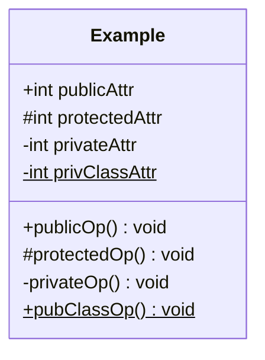
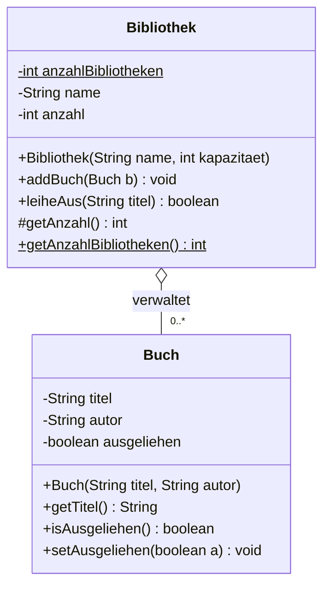
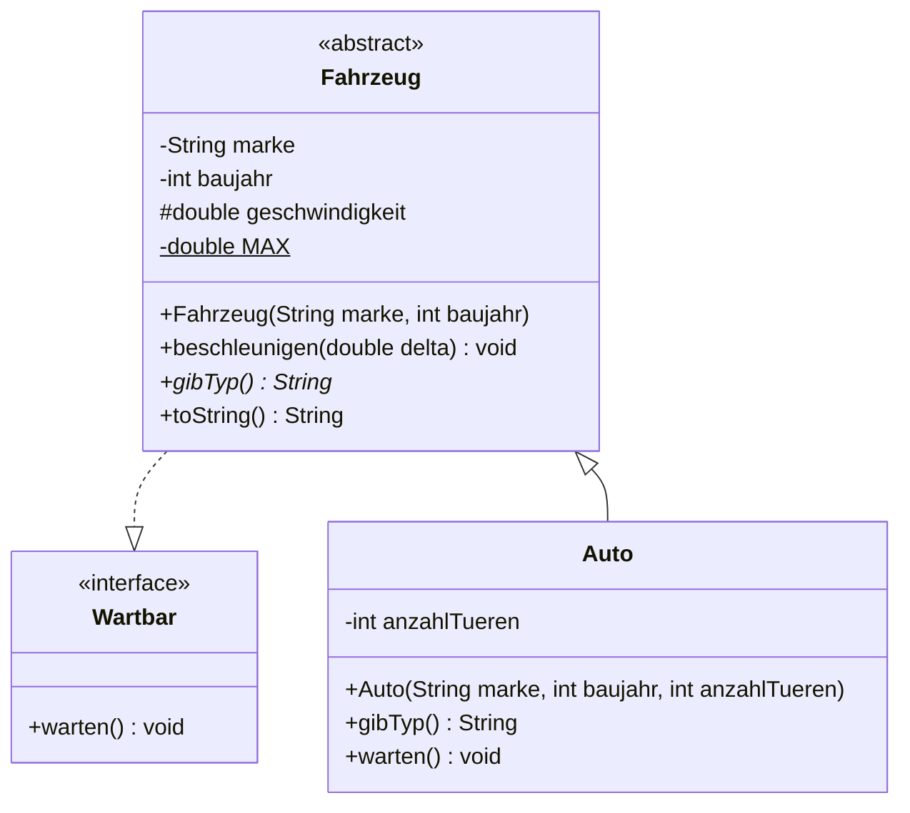
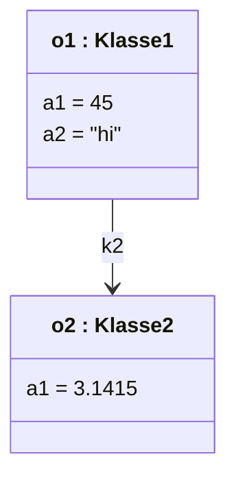

## Warum das in der Klausur zählt

UML ist erklärtes Lernziel der Vorlesung — Kapitel 6 heißt "Objekte und Methoden, **UML Teil 1**", Kapitel 7 "Vererbung und Polymorphie, **UML Teil 2**". Im Klausur-Überblick des Skripts nehmen die Diagramme vier von acht Zusammenfassungsfolien zu Kapitel 6 und 7 ein (OFP_Java.pdf, S. 364–368). Der Dozent zeigt dort konsequent **beide Richtungen nebeneinander**: links das Diagramm, rechts der Java-Code.

In der Klausur taucht das als Kurzfrage in Aufgabe 1 auf ("Was bedeutet die Unterstreichung?"), als Teilaufgabe in Aufgabe 4 oder 5 ("Setzen Sie das Diagramm 1:1 in Java um") oder umgekehrt. Das Übungsblatt zu Objekten und Klassen fordert wörtlich: *"Bei Aufgaben mit UML-Diagramm: Setze JEDES Detail (Attribute, Sichtbarkeiten, Methodensignaturen) korrekt um"* (Aufgaben_Objekte_Klassen_UML.pdf). Genau daran hängen die Punkte — nicht am schön gezeichneten Kasten.

## Die Notationstabelle

| UML | Java | Bedeutung |
|---|---|---|
| `+ attr: int` | `public int attr;` | public |
| `# attr: int` | `protected int attr;` | protected |
| `- attr: int` | `private int attr;` | private |
| `~ attr: int` | `int attr;` | package (ohne Angabe) |
| `klassenattr` — **unterstrichen** | `static` | Klassenattribut / Klassenmethode |
| `Klassenname` — *kursiv* | `abstract class` | abstrakte Klasse |
| `op()` — *kursiv* oder `{abstract}` | `abstract`-Methode | keine Implementierung |
| `<<interface>>` | `interface` | Stereotyp über dem Namen |
| `name: String[1..3]` | `String[] name;` | Attribut-Multiplizität |
| `op(in p: int): double` | `double op(int p)` | Operation mit Parameter und Rückgabetyp |

Und die Linien (OFP_Java.pdf, S. 185–187, 208):

| Linie | Bedeutung | Java |
|---|---|---|
| durchgezogen, **leere Dreiecksspitze** zur Oberklasse | Generalisierung/Vererbung | `extends` |
| **gestrichelt**, leere Dreiecksspitze | Realisierung | `implements` |
| einfache Linie, ggf. mit Pfeil | Assoziation (Navigierbarkeit) | Attribut vom Typ der anderen Klasse |
| **leere Raute** am Ganzen | Aggregation ("hat", Teil überlebt allein) | Attribut/Array |
| **gefüllte Raute** am Ganzen | Komposition (Teil stirbt mit dem Ganzen) | Attribut/Array |

Multiplizitäten stehen am Linienende: `1` genau eins, `0..1` optional, `3..*` drei oder mehr, `*` beliebig viele (inklusive 0), `2,4` zwei oder vier (OFP_Java.pdf, S. 176).

Notation aller Sichtbarkeiten in einem Kasten, `privClassAttr` und `pubClassOp()` sind `static` und deshalb unterstrichen (OFP_Java.pdf, S. 364):



## Richtung 1: aus Code ein Klassendiagramm

Vorgehen: (1) einen Kasten pro Klasse, (2) alle Attribute mit Sichtbarkeitszeichen und Typ, (3) alle Operationen mit Parametern und Rückgabetyp, (4) `static` unterstreichen, (5) Attribute, deren Typ eine **andere Klasse** ist, nicht als Attribut hinschreiben, sondern als **Assoziationslinie mit Multiplizität** zeichnen.

```java
class Buch {
  private String titel;
  private String autor;
  private boolean ausgeliehen = false;
  public Buch(String titel, String autor) {
    this.titel = titel; this.autor = autor;
  }
  public String getTitel()   { return titel; }
  public boolean isAusgeliehen() { return ausgeliehen; }
  public void setAusgeliehen(boolean a) { this.ausgeliehen = a; }
}

class Bibliothek {
  private static int anzahlBibliotheken = 0;   // Klassenattribut -> unterstrichen
  private String name;
  private Buch[] bestand;                      // Aggregation 1 -> 0..*
  private int anzahl = 0;

  public Bibliothek(String name, int kapazitaet) {
    this.name = name;
    this.bestand = new Buch[kapazitaet];
    anzahlBibliotheken++;
  }
  public void addBuch(Buch b) { bestand[anzahl++] = b; }
  public boolean leiheAus(String titel) {
    for (int i = 0; i < anzahl; i++) {
      if (bestand[i].getTitel().equals(titel) && !bestand[i].isAusgeliehen()) {
        bestand[i].setAusgeliehen(true);
        return true;
      }
    }
    return false;
  }
  protected int getAnzahl() { return anzahl; }
  public static int getAnzahlBibliotheken() { return anzahlBibliotheken; }
}
```

Daraus wird:



Warum **Aggregation** (leere Raute) und nicht Komposition? Ein `Buch` kann ohne Bibliothek existieren und die Bibliothek erzeugt es nicht selbst — genau die Definition aus dem Skript. Wäre `bestand` dagegen ein Teil, das mit dem Ganzen entsteht und stirbt (z. B. `Zimmer` in `Haus`), zeichnest du die **gefüllte** Raute. Beachte auch: `bestand` erscheint **nicht** als Attributzeile, sondern wird durch die Linie ausgedrückt.

## Richtung 2: aus einem Diagramm Code



Lies das Diagramm zeilenweise ab: `<<interface>>` → `interface`, gestrichelte Linie → `implements`, kursiver Klassenname → `abstract class`, kursive Operation (`gibTyp`) → `abstract`-Methode ohne Rumpf, unterstrichenes `MAX` → `static`, `#` → `protected`, durchgezogene Dreiecksspitze → `extends`.

```java
interface Wartbar {                       // <<interface>>
  void warten();                          // implizit public abstract
}

abstract class Fahrzeug implements Wartbar {   // Name kursiv im Diagramm
  private String marke;
  private int baujahr;
  protected double geschwindigkeit = 0.0;
  private static final double MAX = 250.0;     // unterstrichen im Diagramm

  public Fahrzeug(String marke, int baujahr) {
    this.marke = marke; this.baujahr = baujahr;
  }
  public void beschleunigen(double delta) {
    geschwindigkeit = Math.min(geschwindigkeit + delta, MAX);
  }
  public abstract String gibTyp();             // kursiv im Diagramm
  public String toString() {
    return gibTyp() + " " + marke + " (" + baujahr + "): " + geschwindigkeit + " km/h";
  }
}

class Auto extends Fahrzeug {
  private int anzahlTueren;
  public Auto(String marke, int baujahr, int anzahlTueren) {
    super(marke, baujahr);                     // ERSTE Anweisung
    this.anzahlTueren = anzahlTueren;
  }
  public String gibTyp() { return "Auto"; }
  public void warten() { System.out.println("Oelwechsel"); }
}

class FahrzeugApp {
  public static void main(String[] s) {
    Fahrzeug[] flotte = { new Auto("VW", 2020, 5) };
    for (int i = 0; i < flotte.length; i++) {
      flotte[i].beschleunigen(300.0);
      System.out.println(flotte[i]);
      flotte[i].warten();
    }
  }
}
```

Ausgabe: `Auto VW (2020): 250.0 km/h` und `Oelwechsel`. Beachte: `Auto` muss `warten()` implementieren, weil `Fahrzeug` die geerbte Interface-Methode offengelassen hat.

## Objektdiagramme

Ein Objektdiagramm ist eine **Momentaufnahme zur Laufzeit**: kein Bauplan, sondern konkrete Objekte mit konkreten Werten. Notation `objektname : Klasse` (unterstrichen), darunter `attribut = wert`; Operationen fehlen, weil sie für alle Objekte gleich sind. Anonyme Objekte schreibt man `: Klasse` (OFP_Java.pdf, S. 162–163, 365).

```java
class Klasse1 { private int a1 = 45; private String a2 = "hi"; public Klasse2 k2; }
class Klasse2 { private double a1; public Klasse2(double a1) { this.a1 = a1; } }
// Klasse1 o1 = new Klasse1();
// Klasse2 o2 = new Klasse2(3.1415);
// o1.k2 = o2;
```



Beachte: `a1` heißt in beiden Klassen gleich, hat aber **verschiedene Werte pro Objekt** — genau das macht ein Objektdiagramm sichtbar. Zwei Objekte mit gleichen Attributwerten sind *gleich*, aber nicht *identisch* (OFP_Java.pdf, S. 164–165).

## Typische Fehler

1. **Sichtbarkeitszeichen weglassen.** Ohne `+ # -` ist die Zeile unvollständig und der Punkt weg.
2. **`static` nicht unterstrichen.** Die Unterstreichung ist die *einzige* UML-Kennzeichnung für Klassenattribute und -methoden.
3. **Abstrakte Klasse/Methode nicht kursiv** (oder ohne `{abstract}`) — dann steht dort eine ganz normale Klasse.
4. **Vererbung und Realisierung verwechselt**: `extends` durchgezogen, `implements` gestrichelt, beide mit *leerer* Dreiecksspitze.
5. **Assoziation als Attributzeile schreiben.** Ein Attribut vom Typ einer anderen Klasse gehört als Linie mit Multiplizität ins Diagramm.
6. **Multiplizität auf der falschen Seite.** Sie steht immer an dem Ende, dessen Objektanzahl sie beschreibt.
7. **Aggregation statt Komposition** (und umgekehrt): leere Raute = Teil existiert selbständig, gefüllte Raute = Teil gehört zu genau einem Ganzen und stirbt mit ihm.
8. **Objekt- und Klassendiagramm vermischt**: im Objektdiagramm stehen Werte, keine Typen und keine Operationen.

## Merksätze

- **Unterstrichen = `static`, kursiv = `abstract`.** Zwei Zeichen, zwei sichere Punkte.
- **`+ public`, `# protected`, `- private`, `~ package`** — in dieser Reihenfolge von offen nach geschlossen.
- **Gestrichelt heißt `implements`, durchgezogen heißt `extends`** — Spitze immer zum Allgemeineren.
- **Leere Raute: das Teil überlebt. Gefüllte Raute: das Teil stirbt mit.**
- **Klassendiagramm = Bauplan mit Typen, Objektdiagramm = Momentaufnahme mit Werten.**
